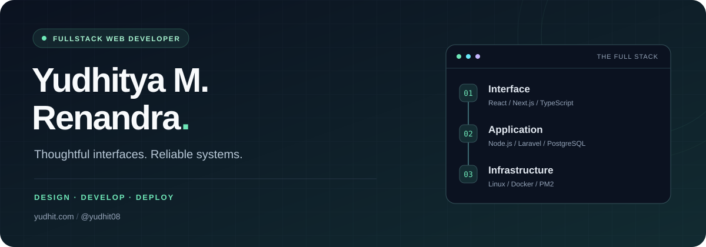

  

  
  
  

<h3 align="center">From the first interaction to the last database query.</h3>

  I build fullstack web applications with a focus on clear interfaces, 
  maintainable code, and reliable systems behind the scenes.

---

### A little about me

I'm **Yudhitya M. Renandra**, a fullstack web developer who enjoys connecting the pieces that make a web application work: the interface people use, the APIs that power it, the data underneath, and the server that keeps it running.

**JavaScript and TypeScript** are at the heart of my toolkit. I work across React and Next.js on the frontend, Node.js and Laravel on the backend, and relational databases. My focus is on making applications easier to use, maintain, and grow.

### What I bring to a project

<table>
  <tr>
    <td width="50%" valign="top">
      <h3>01 / Interface &amp; experience</h3>
      
Build web interfaces with reusable components and consistent styling to keep the experience clear and cohesive.

      <b>REACT · NEXT.JS · TYPESCRIPT · TAILWIND CSS · MUI</b>
    </td>
    <td width="50%" valign="top">
      <h3>02 / APIs &amp; application logic</h3>
      
Design RESTful APIs and organize backend logic so applications are easier to integrate, extend, and maintain.

      <b>NODE.JS · EXPRESS.JS · LARAVEL · REST APIs</b>
    </td>
  </tr>
  <tr>
    <td width="50%" valign="top">
      <h3>03 / Data &amp; architecture</h3>
      
Structure relational data, work with application models, and optimize database interactions to support reliable application behavior.

      <b>POSTGRESQL · PRISMA · SEQUELIZE</b>
    </td>
    <td width="50%" valign="top">
      <h3>04 / Deployment &amp; operations</h3>
      
Deploy and maintain applications on Linux servers, manage application processes, and improve performance as systems evolve.

      <b>LINUX · DOCKER · PM2 · GIT &amp; GITHUB</b>
    </td>
  </tr>
</table>

### My development toolkit

  
  
  
  
  
  

  
  
  
  
  
  

  
  
  
  
  

### How I approach development

- **Keep the experience clear.** Make interfaces understandable and interactions predictable.
- **Build for the next change.** Favor readable code, reusable components, and clear boundaries.
- **Think beyond the frontend.** Consider API behavior, data structure, and deployment together.
- **Make performance part of the work.** Improve queries, application logic, and server reliability.

---

<b>Have a project in mind? Let's talk.</b>

  <a href="https://yudhit.com">Explore my portfolio</a>
  &nbsp; / &nbsp;
  <a href="https://www.linkedin.com/in/yudhitya-mr">Connect on LinkedIn</a>
  &nbsp; / &nbsp;
  <a href="mailto:yudhitrenandra99@gmail.com">Get in touch</a>

Thoughtful interfaces. Reliable systems. Room to grow.

